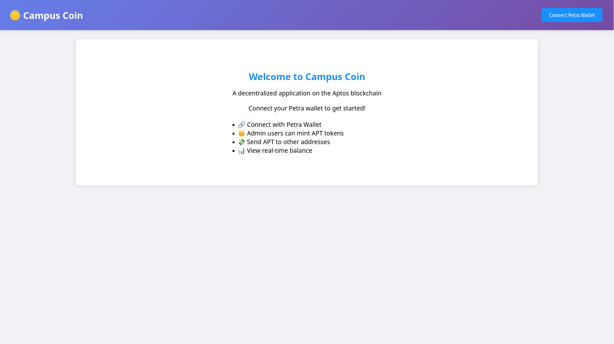
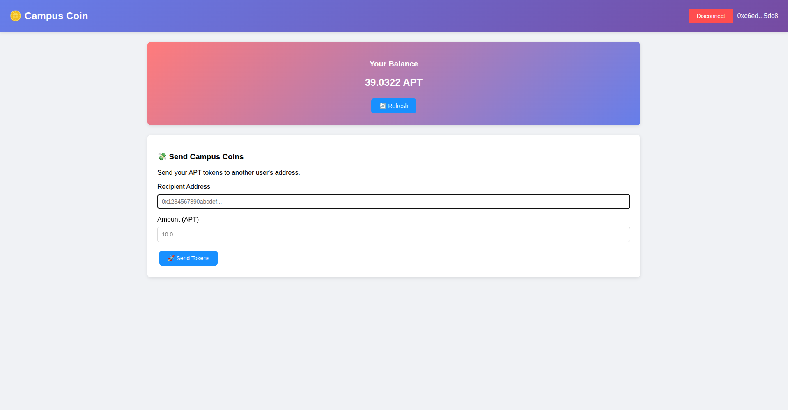

# Campus Coin - Aptos Full Stack DApp

A full-stack decentralized application built on the Aptos blockchain that allows users to manage APT tokens. Administrators can mint tokens to users, and users can send tokens to other addresses using their Petra wallet.

## Features

🔐 **Wallet Integration**: Connect using Petra wallet  
👑 **Admin Panel**: Mint APT tokens to any address (admin users only)  
💸 **User Dashboard**: Send APT tokens to other addresses  
📊 **Real-time Balance**: View current APT balance  
🔒 **Role-based Access**: Different interfaces for admins and regular users  

## Screenshots


## Tech Stack

### Frontend
- **HTML5 + CSS3 + JavaScript**: Modern web standards
- **Petra Wallet Integration**: Direct wallet connection
- **Responsive Design**: Works on desktop and mobile
- **Real-time API Integration**: Live blockchain data

### Backend
- **Node.js + Express**: RESTful API server
- **Aptos TypeScript SDK**: Blockchain data fetching
- **CORS + Helmet**: Security middleware
- **Environment Variables**: Configuration management

## Project Structure

```
campus-coin-aptos/
├── frontend/               # HTML5 frontend application
│   └── index.html         # Main application file
└── backend/               # Node.js backend API
    ├── src/
    │   ├── controllers/   # Request handlers
    │   ├── routes/        # API routes
    │   ├── middleware/    # Custom middleware
    │   └── server.js      # Entry point
    ├── package.json
    └── .env              # Environment variables
```

## Getting Started

### Prerequisites
- Node.js (v16 or higher)
- npm or yarn
- Petra Wallet browser extension

### Installation

1. **Clone and setup the project:**
   ```bash
   cd campus-coin-aptos
   ```

2. **Install backend dependencies:**
   ```bash
   cd backend
   npm install
   ```

3. **Configure environment variables:**
   - Edit `backend/.env` to set admin addresses
   - Add your wallet address to `ADMIN_ADDRESSES` to test admin features

4. **Start the development servers:**
   ```bash
   ./start-dev.sh
   ```

5. **Open your browser:**
   - Frontend: http://localhost:3000
   - Backend API: http://localhost:5000

## Usage

### For Regular Users:
1. Connect your Petra wallet
2. View your APT balance
3. Send APT tokens to other addresses
4. Refresh balance to see updates

### For Administrators:
1. Connect your Petra wallet (must be in admin list)
2. Access the admin panel
3. Mint APT tokens to any user address
4. Monitor your admin privileges

## API Endpoints

### Aptos Operations
- `GET /api/aptos/balance/:address` - Get APT balance
- `GET /api/aptos/transactions/:address` - Get transaction history
- `POST /api/aptos/send` - Validate send transaction
- `POST /api/aptos/mint` - Mint tokens (admin only)
- `GET /api/aptos/admin/:address` - Check admin status

### Authentication
- `POST /api/auth/verify` - Verify wallet signature
- `GET /api/auth/profile/:address` - Get user profile

### Health Check
- `GET /api/health` - Service health status

## Configuration

### Admin Setup
Edit `backend/.env` and add admin wallet addresses:
```env
ADMIN_ADDRESSES=0x1234...,0x5678...
```

### Network Configuration
The app is configured for Aptos Devnet. To use Testnet or Mainnet:
1. Update `APTOS_NETWORK` in backend `.env`
2. Update network references in frontend if needed

## Troubleshooting

### Common Issues:
1. **Wallet connection fails**: Ensure Petra wallet extension is installed
2. **Balance shows 0**: Make sure your account has APT (use faucet for devnet)
3. **Admin features not working**: Check that your address is in `ADMIN_ADDRESSES`
4. **CORS errors**: Ensure backend is running and FRONTEND_URL is correct

### Getting Test APT:
For Devnet testing, use the [Aptos Faucet](https://aptoslabs.com/developers) to get test APT tokens.

## Contributing

1. Fork the repository
2. Create a feature branch
3. Make your changes
4. Test thoroughly
5. Submit a pull request

## License

This project is licensed under the MIT License.

## Resources

- [Aptos Documentation](https://aptos.dev/)
- [Petra Wallet](https://petra.app/)
- [Aptos TypeScript SDK](https://github.com/aptos-labs/aptos-ts-sdk)
- [Node.js Documentation](https://nodejs.org/)
